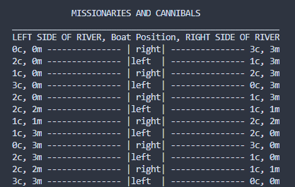

# Missionaries and Cannibals

Python solution to the popular Missionaries and Cannibals puzzle. This solution implements an AI Breadth-First Search (BFS) algorithm.

## Problem Statement

Three missionaries and three cannibals are on one side of a river, along with a boat that can hold one or
    two people. Find a way to get everyone to the other side without ever leaving a group of
    missionaries in one place outnumbered by the cannibals in that place.

more info can be found on the [wiki](https://en.wikipedia.org/wiki/Missionaries_and_cannibals_problem)

Here is what the output looks like: 

## Contributors
Blake Engelbrecht 

